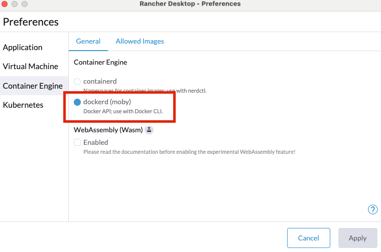

# Langfuse Local Setup (v2)

このリポジトリは、Langfuse v2 を macOS の Rancher Desktop 環境でローカル実行するためのセットアップガイドです。


## 🚀 前提条件

- macOS
- Rancher Desktop


## ⚙️ Rancher Desktop 設定

1. Rancher Desktop を起動
2. 左メニュー「Virtual Machine」→ Enabled（ON）
3. 「Container Runtime」→ dockerd (moby)


4. 動作確認コマンド
```bash
    docker version
```


## 📦 プロジェクト構成

    langfuse-local/
    ├─ docker-compose.yml
    └─ README.md


## ▶ 起動方法

    docker compose up -d

### 起動状態確認

    docker compose ps


## 🌐 ブラウザアクセス

    http://localhost:3000

### 初回ログイン

- メールアドレス：任意 (例: test@example.com)
- パスワード：任意（8文字以上）


## 🛑 停止・削除

| 操作 | コマンド |
|---|---|
| 停止（データ保持） | docker compose stop |
| 再開 | docker compose start |
| コンテナ削除（データ保持） | docker compose down |
| コンテナ＋DB完全削除 | docker compose down -v |


## 🐛 トラブルシューティング

### 起動ログ確認

    docker compose logs -f


## 📝 ライセンス

この設定はローカル検証目的で使用可能です。
